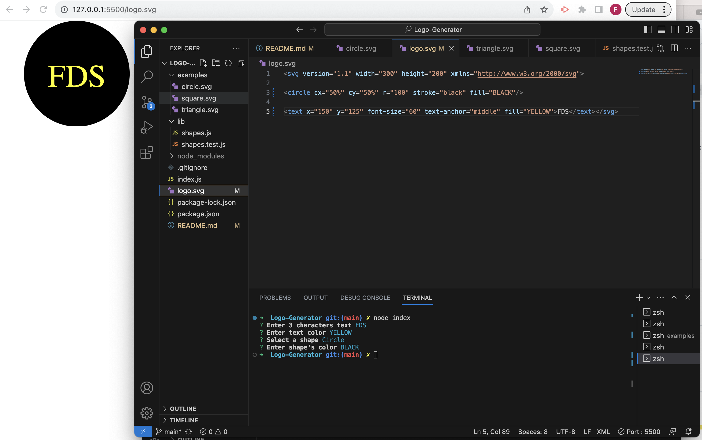

# Logo-Generator

## Description
A logo is a visual representation of a brand or company. It is a unique symbol or design that is easily recognizable and helps to communicate the values and identity of the organization. With that in mind, Logo-Generator is a tool that allows users to create custom logos quickly and easily. 

## Installations
Node.JS 
Jest Version 29.6.3
Inquirer.js: Version 8.2.4

## Usage
Open index.js in Integrated Terminal, type node index. Enter 3 characters text, and type the text color desired. Choose your logo's shape between TRIANGLE, SQUARE or CIRCLE, and type your shape's color desired. Your new logo is generated in logo.svg file, open with live server to check it out.

## Reference

[Walkthrough Video Demo Link]()

